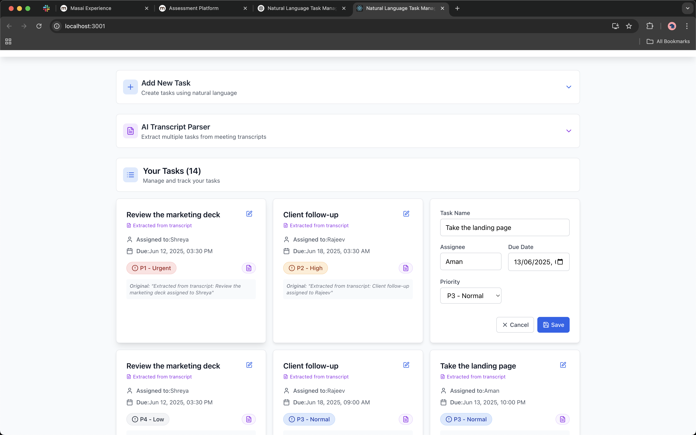
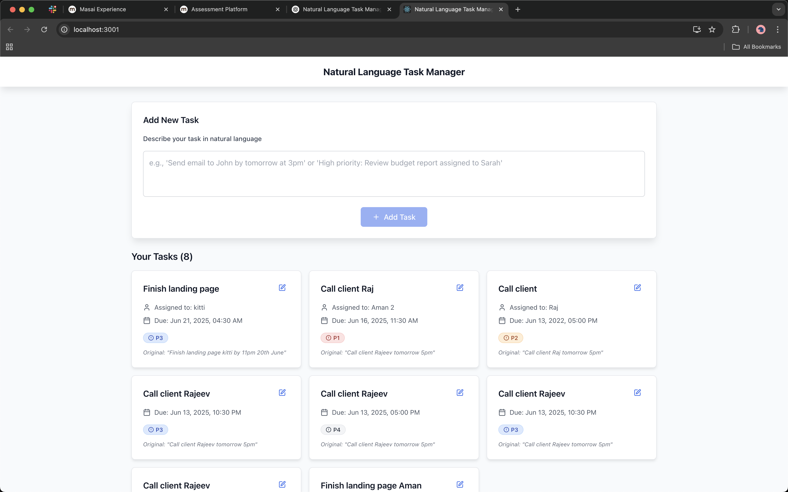
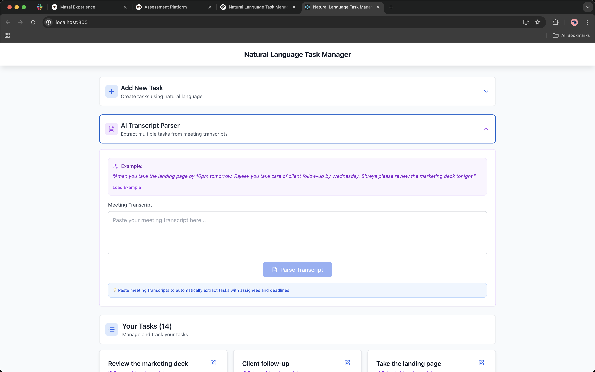
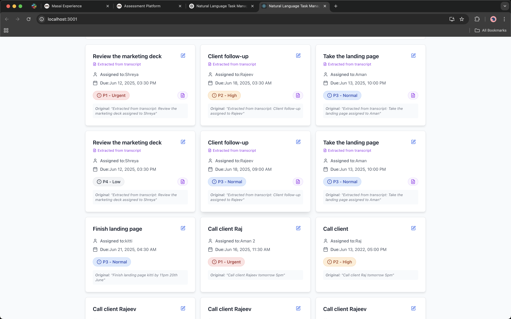
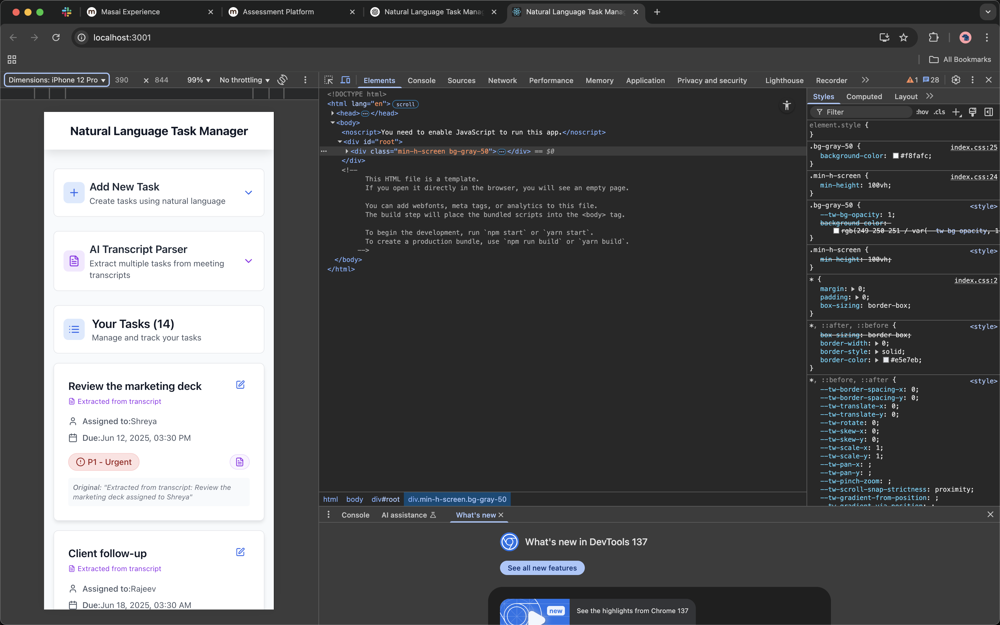

# Natural Language Task Manager

A full-stack task management application that allows users to create tasks using natural language input.


## Features

- 🤖 **Natural Language Processing**: Create tasks using plain English
- 📝 **Task Management**: Full CRUD operations for tasks
- 🎯 **Smart Parsing**: Automatically extracts task details like assignee, priority, and due dates
- 📋 **AI Transcript Parser**: Extract multiple tasks from meeting transcripts
- 🔒 **Secure**: Rate limiting and security middleware
- 📱 **Responsive**: Modern React frontend with Tailwind CSS

## Screenshots

### Main Dashboard

*Clean interface showing task list with toggleable input sections*

### Add New Task

*Natural language task creation with intelligent parsing*

### AI Transcript Parser

*Bulk task extraction from meeting transcripts*

### Task Management

*Interactive task cards with priority indicators and editing capabilities*

### Responsive Design

*Fully responsive design works seamlessly on mobile devices*

## Tech Stack

### Frontend
- React 19
- Tailwind CSS
- Axios for API calls
- Lucide React icons

### Backend
- Node.js with Express
- MongoDB with Mongoose
- OpenAI GPT for natural language processing
- Security middleware (Helmet, CORS, Rate Limiting)

## Project Structure

```
├── client/                 # React frontend
│   ├── src/
│   │   ├── components/     # Reusable UI components
│   │   └── services/       # API service layer
│   └── public/             # Static assets
├── server/                 # Node.js backend
│   ├── config/             # Database configuration
│   ├── controllers/        # Route controllers
│   ├── middleware/         # Custom middleware
│   ├── models/             # MongoDB models
│   ├── routes/             # API routes
│   └── services/           # Business logic
└── README.md
```

## Setup Instructions

### Prerequisites
- Node.js (v16 or higher)
- MongoDB Atlas account or local MongoDB
- OpenAI API key

### Installation

1. **Clone the repository**
   ```bash
   git clone <repository-url>
   cd Day2
   ```

2. **Setup Backend**
   ```bash
   cd server
   npm install
   
   # Copy environment variables
   cp .env.example .env
   # Edit .env with your actual values:
   # - OPENAI_API_KEY: Your OpenAI API key
   # - MONGODB_URI: Your MongoDB connection string
   # - PORT: Server port (default: 5001)
   ```

3. **Setup Frontend**
   ```bash
   cd ../client
   npm install
   ```

### Running the Application

1. **Start the backend server**
   ```bash
   cd server
   npm run dev
   ```
   Server will run on http://localhost:5001

2. **Start the frontend (in a new terminal)**
   ```bash
   cd client
   npm start
   ```
   Frontend will run on http://localhost:3000

## Environment Variables

### Server (.env)
```bash
PORT=5001
MONGODB_URI=your_mongodb_connection_string
OPENAI_API_KEY=your_openai_api_key
NODE_ENV=development
```

## API Endpoints

- `GET /api/tasks` - Get all tasks
- `POST /api/tasks` - Create a new task with natural language
- `POST /api/tasks/parse-transcript` - Parse meeting transcript into multiple tasks
- `PATCH /api/tasks/:id` - Update a task

## Natural Language Examples

The application can parse various natural language inputs:

### Single Task Creation:
- "Send email to John by tomorrow at 3pm"
- "High priority: Review budget report assigned to Sarah"
- "Call client Rajeev tomorrow at 5pm"
- "Finish landing page Aman by 11pm 20th June"
- "Meeting with Mark assigned to Alice"

### Meeting Transcript Parsing:
The AI transcript parser can extract multiple tasks from meeting notes:

**Input:**
```
"Aman you take the landing page by 10pm tomorrow. Rajeev you take care of client follow-up by Wednesday. Shreya please review the marketing deck tonight."
```

**Output:** 
Creates 3 separate tasks with proper assignees and deadlines:
- Task: "Take the landing page" → Assigned to: Aman → Due: Tomorrow 10:00 PM
- Task: "Client follow-up" → Assigned to: Rajeev → Due: Wednesday 9:00 AM  
- Task: "Review the marketing deck" → Assigned to: Shreya → Due: Tonight 9:00 PM

## Git Ignore

Both client and server directories have comprehensive `.gitignore` files that exclude:
- `node_modules/`
- Environment variables (`.env`)
- Build outputs
- IDE/editor files
- OS generated files
- Logs and cache files

## Contributing

1. Fork the repository
2. Create a feature branch
3. Make your changes
4. Test thoroughly
5. Submit a pull request

## License

This project is licensed under the MIT License.
